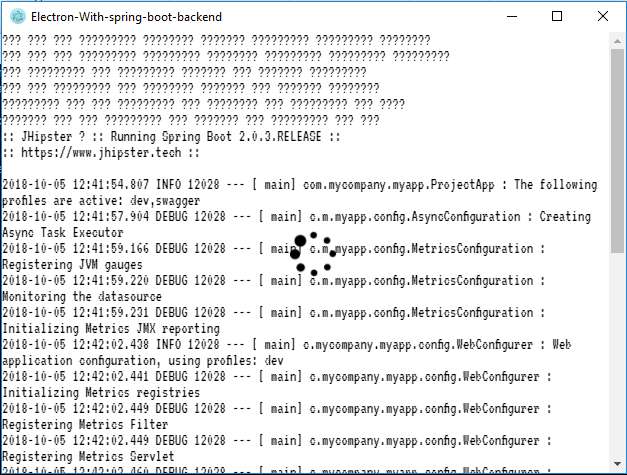

[](https://www.npmjs.com/package/generator-electron-war-package)&nbsp;&nbsp;
&nbsp;<a href="https://github.com/fullStackApp/generator-electron-war-package/issues">
</a>&nbsp;

## generator-electron-war-package [](https://travis-ci.com/fullStackApp/generator-electron-war-package)

> A yeoman generator to run spring boot war app in electron package mapping the [generator-jhipster-electron](https://github.com/amanganiello90/generator-jhipster-electron). 
You can use it to generate an electron exe that runs your target/*.war package in a generic spring-boot project.

## NEWS

For every release there is the features list in [CHANGELOG](https://github.com/fullStackApp/generator-electron-war-package/blob/master/CHANGELOG.md)


## Generator Installation

First, install [Yeoman](http://yeoman.io) and generator-electron-war-package [npm](https://www.npmjs.com/) (we assume you have pre-installed [node.js](https://nodejs.org/)).

```bash
npm install -g yo
npm install -g generator-electron-war-package
```

## Usage

After installation, generate your new project:

```bash
yo electron-war-package
```

It will be created a folder named **electron-war-package**. After installing dependencies you can run in this:

* `npm start` : it runs the app in a live electron process
* `npm package` : it creates an **electron-war 1.0.0.exe** app in **electron-war-package/distribution**

For both, you can read the backend log into the electron window using **F1 keyword**:




> The default port used in spring boot, called from the electron app, is **8081**. You can change it in the **electron.app.config.json**


## File tree

```
├── electron-war-package
│      ├── electron.app.config.json   
│      ├── icon.png
│      ├── index.html
│      ├── main.js
│      ├── package.json
│      └── README.md

```

## Getting To Know Yeoman

 * Yeoman has a heart of gold.
 * Yeoman is a person with feelings and opinions, but is very easy to work with.
 * Yeoman can be too opinionated at times but is easily convinced not to be.
 * Feel free to [learn more about Yeoman](http://yeoman.io/).

## License

This project is licensed under the MIT License - see the [LICENSE](LICENSE) file for details.
